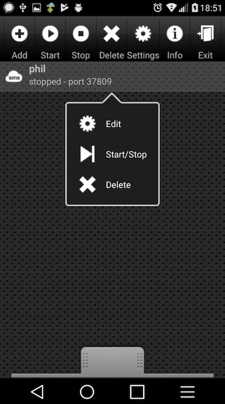
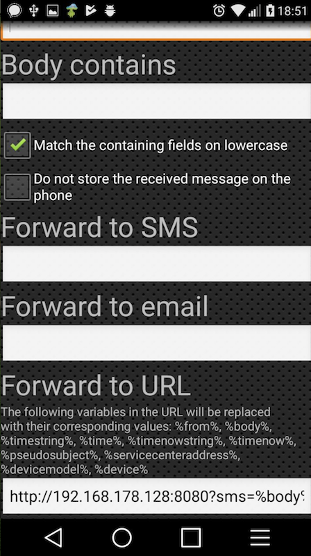

# ADB Controller

node script using adb (android-debug-bridge) as a bridge for incoming android
outgoing calls between a computer and an android phone.

basic hack to make robocalls from a computer. don't be evil! use it for fun stuff
like scavanger hunts!

## dependencies

- node
- npm packages:
    - express
    - http
    - shelljs
    - playsound
- adb:

  Android Debug Bridge version 1.0.39 Version 0.0.1-4500957
  Installed as /usr/local/bin/adb

- an *Android* phone
    - build and tested with **Android V 7.0 Kernel version 3.18.35**
    - Preferences > General > Developer Options > USB Debugging On
    - connected via USB to machine running the script
    - from Google PlayStore: App "SMS Gateway Ultimate"

    
    
    
        - config: FORWARDING Rule URL:

          `<IP OF MACHINE RUNNING THE SCRIPT>:8080?num=%from%&sms=%body%`
        - connected via Network (I tested at home via Wifi)

## usage

```
const adb = require("./server.js")

makeCALLOUT("+49xxxxxxxxxxxx"); // make Call

sendSMS("http://<IP OF ANDROID DEVICE>:<PORT OF SMS SERVER>","+4949xxxxxxxxxxxx","Hello world!"); // send SMS

```

###### TO DOs:
- add cancelTimer for clearInterval in case of no answered or errors
- solve problem of soundrouting (hardware? cable soildering? android app?)
- decide on how to deal with the IncomingCall listener (always open or only if not calling in)


#### License
cc-nc-sa 4.0 (by) Philip Steimel www.machinaesc.de
